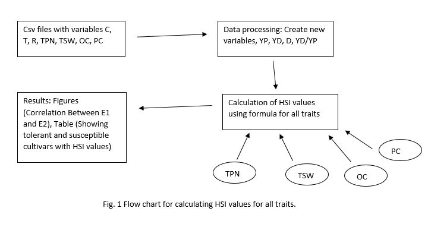

**Name**: Meghnath Pokharel

## Title
Heat susceptibility index as a measure of High night temperature tolerance in winter canola.  
## Objectives
Write a python code to calculate heat susceptibility indices (HSI) for yield and seed quality traits in response to high night temperature (HNT) in winter canola.
## Inputs
For experiment 1and 2 - Individual .csv file with the following columns: Cultivars (C), Treatments (T), Replications (R), total pod number (TPN), total seed weight (TSW), oil content (OC), protein content (PC)

HSI is calculated as by using the following formula as suggested by Fisher and Maurer (1978).

HSI = [l-YD/YP]/D

Where, YD represents mean of the genotypes in HNT stress, YP represents mean of the genotypes under control.
D represents 1- [mean YD of all genotypes/mean YP of all genotypes].

## Outputs
1.Heat susceptibility index values for yield and oil quality traits (table).

2.Correlations between experiment 1 and experiment 2. (graphs)

3.Classify the winter canola cultivars in to resistant and susceptible.

## Rationale
Canola (Brassica napus L.) is an economically valuable oilseed crop and the cultivation of canola is expanding due to its importance in oilseed and bio-diesel industry (FAO 2006). Climate models predict that daily minimum temperature is increasing more than twice that of daily maximum temperature (Vose et al. 2005). Being a cool season winter crop, canola production is extremely sensitive to small variation in temperature particularly during reproductive stages (Angadi et al. 2000) and pod filling (Young et. al., 2004). HIS values for important traits, such as seed yield, have been widely used for selection of tolerant genotypes in spring canola (Koscielny et al., 2018), Wheat (Bhardwaj et. al., 2017) and Barley (Parashar et al., 2019).  The genotypes with high positive HSI values are susceptible to higher temperature and vice versa (Fisher and Maurer, 1978). As a graduate student, I have been exploring the impact of HNT in winter canola from controlled environment chambers. Thus, my goal is to learn python to effectively calculate HSI for various traits so that I will be able to differentiate contrasting lines that can be used in canola breeding for developing winter canola with enhance resilience to HNT exposure under future warming scenarios.

## Sketch

## References
Angadi, S. V., Cutforth, H. W., Miller, P. R., McConkey, B. G., Entz, M. H., Brandt, S. A., & Volkmar, K. M. (2000). Response of three Brassica species to high temperature stress during reproductive growth. Canadian Journal of Plant Science, 80(4), 693-701. 

Young, L. W., Wilen, R. W., & Bonham‐Smith, P. C. (2004). High temperature stress of Brassica napus during flowering reduces micro‐and megagametophyte fertility, induces fruit abortion, and disrupts seed production. Journal of Experimental Botany, 55(396), 485-495. 

