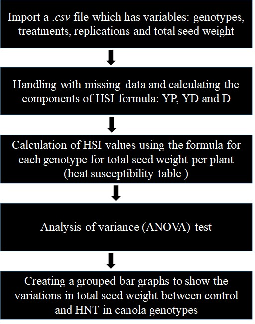

# Calculation of heat susceptibility index to measure the high night temperature tolerance in winter canola
## Objective
Write a python code to calculate heat susceptibility indices (HSI) for yield in response to high night temperature (HNT) in winter canola.
## Inputs
This program uses a total seed weight per plant(g) data file collected from ten canola genotypes under control and HNT exposure for calculating heat susceptibility indices. The data file contains four columns: geno, trt, rep and TSW.

'geno' represents genotypes of winter canola.

'trt' represents treatments used in the experiments.
- Control (23/15°C: day/night) and HNT (23/20°C: day/night) are the two trearments.

'rep' represents the replications within the treatments.

'TSW' represents total seed weight per plant (g). 

HSI is calculated as by using the following formula as suggested by Fisher and Maurer (1978).

$$HSI = \frac{1-\frac{YD}{YP}}{D}$$

Where, YD represents mean of the genotypes in HNT stress, YP represents mean of the genotypes under control.
D represents 1- [mean YD of all genotypes/mean YP of all genotypes].

## Outputs

1. Heat susceptibility index values for yield in ten canola genotypes (table)

2. Identification of tolerant and susceptible canola genotypes based on calculated HSI values. 

3. Analysis of variance (ANOVA).

## Rationale
Canola is an economically valuable oilseed crop and the cultivation of canola is expanding due to its importance in oilseed and bio-diesel industry (FAO 2006). Climate models predict that daily minimum temperature is increasing more than twice that of daily maximum temperature (Vose et al. 2005). Being a cool season winter crop, canola production is extremely sensitive to small variation in temperature particularly during reproductive stages (Angadi et al. 2000) and pod filling (Young et. al., 2004).I have been exploring the impact of HNT stress on various physiological and agronomic traits in diverse sets of winter canola genotypes. Calculating HSI values separately for various traits in large number of genotypes will be tedious and time consuming. This coding will also avoid the potential mannual miscalculations. Thus, this program will help me to effectively select contrasting lines using HSI values for specific trait in canola. This code might be useful for other researchers studying abiotic stress tolerance in crops.

## Sketch

## References
Angadi, S. V., Cutforth, H. W., Miller, P. R., McConkey, B. G., Entz, M. H., Brandt, S. A., & Volkmar, K. M. (2000). Response of three Brassica species to high temperature stress during reproductive growth. Canadian Journal of Plant Science, 80(4), 693-701. 

Young, L. W., Wilen, R. W., & Bonham‐Smith, P. C. (2004). High temperature stress of Brassica napus during flowering reduces micro‐and megagametophyte fertility, induces fruit abortion, and disrupts seed production. Journal of Experimental Botany, 55(396), 485-495. 

